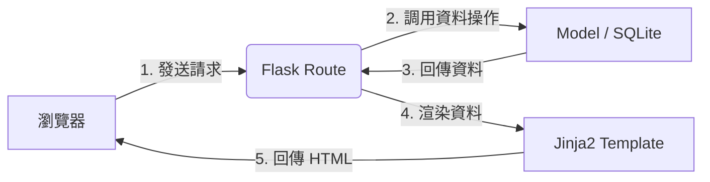

# 系統架構設計文件 (ARCHITECTURE.md) - 任務管理系統

## 1. 技術架構說明

本專案採用經典的 Web 開發模式，強調穩定性與開發效率。

### 選用技術與原因
- **後端：Python + Flask**
  - **原因**：Flask 是一個微型框架，不強制規定專案結構，非常適合教學與中小型專案。其生態系豐富且擴充容易。
- **模板引擎：Jinja2**
  - **原因**：Flask 內建支援，能讓後端資料直接與 HTML 結合。不需要建構複雜的前端開發環境（如 React/Vue）。
- **資料庫：SQLite (Native SQL)**
  - **原因**：SQLite 是以檔案形式存在的資料庫，不需要安裝外部伺服器。使用原生 SQL (`sqlite3`) 能讓開發者對 SQL 語言有更深刻的理解。

### Flask MVC 模式說明
雖然 Flask 不像 Django 或 Laravel 那樣強制 MVC，但我們遵循以下分層原則：
- **Model (模型)**：負責與 SQLite 溝通，處理資料的讀取、寫入與格式化。位於 `app/models/`。
- **View (視圖)**：負責呈現資料給使用者（HTML 頁面）。位於 `app/templates/`。
- **Controller (控制器)**：負責處理請求、商業邏輯與調度 Model 與 View。在 Flask 中，這對應到路由函式（Routes），位於 `app/routes/`。

---

## 2. 專案資料夾結構

```text
web_app_development/
├── app/                    # 應用程式核心資料夾
│   ├── models/            # 資料庫操作邏輯 (Native SQL scripts)
│   ├── routes/            # 路由定義 (Controller 邏輯)
│   ├── static/            # 靜態資源 (CSS, Javascript, Images)
│   │   └── css/           # 樣式表
│   └── templates/         # Jinja2 模板 (HTML 頁面)
│       └── components/    # 可重複使用的 UI 元件
├── docs/                   # 專案文件 (PRD, Architecture 等)
├── instance/               # 存放執行實例資料 (如 SQLite 資料庫)
│   └── database.db        # SQLite 資料庫檔案 (Git 會忽略其內容)
├── .gitignore              # Git 忽略清單
├── app.py                  # 應用程式入口點 (初始化 Flask)
├── requirements.txt        # Python 依賴套件清單
└── README.md               # 專案簡介
```

---

## 3. 元件關係圖

以下展示了從使用者發出請求到收到回覆的資料流向：



---

## 4. 關鍵設計決策

### 1. 使用 Blueprint 模組化路由
為了避免 `app.py` 變得過於臃腫，我們將使用 Flask 的 `Blueprint` 功能。將任務相關的路由放在 `app/routes/tasks.py`，有利於程式碼結構的清晰與未來功能（如用戶系統）的擴展。

### 2. 獨立的資料庫初始化腳本
我們將使用一個單獨的 `schema.sql` 檔案來定義資料表結構，並在應用程式初次啟動時（或透過命令列）執行。這能確保資料庫結構的版本一致性。

### 3. Native SQL 封裝方式
雖然不使用 ORM，但我們會在 `app/models/` 中將 SQL 語句封裝成 Python 函式。例如 `get_all_tasks()`，這樣 Controller 就不需要直接處理複雜的 SQL 連線與關閉邏輯。

### 4. 資料夾層級區分
將 `instance/` 資料夾與 `app/` 分開，這是 Flask 的建議做法，用於存放不應包含在應用程式源碼中的配置或資料庫檔案。

---
