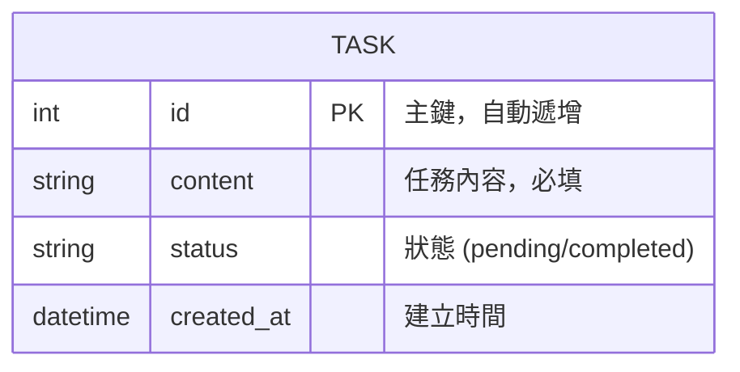

# 資料庫設計文件 (DB_DESIGN.md) - 任務管理系統

## 1. ER 圖 (實體關係圖)

本系統目前為單表結構，專注於任務的生命週期管理。



---

## 2. 資料表詳細說明

### 資料表：`tasks`
存放系統中所有的代辦事項。

| 欄位名稱 | 型別 | 說明 | 必填 | 預設值 |
| :--- | :--- | :--- | :--- | :--- |
| **id** | INTEGER | 主鍵 (Primary Key) | 是 | 自動遞增 |
| **content** | TEXT | 任務描述內容 | 是 | 無 |
| **status** | TEXT | 目前狀態 (pending: 待辦, completed: 已完成) | 是 | 'pending' |
| **created_at** | DATETIME | 任務建立的時間點 | 是 | CURRENT_TIMESTAMP |

---

## 3. SQL 建表語法

完整語法儲存於 `database/schema.sql`：

```sql
CREATE TABLE IF NOT EXISTS tasks (
    id INTEGER PRIMARY KEY AUTOINCREMENT,
    content TEXT NOT NULL,
    status TEXT NOT NULL DEFAULT 'pending',
    created_at DATETIME DEFAULT CURRENT_TIMESTAMP
);
```

---

## 4. Python Model 實作說明

模型層實作於 `app/models/task.py`，使用 Python 內建的 `sqlite3` 模組進行操作。

### 提供的方法 (CRUD Methods)
- `get_db_connection()`: 管理 SQLite 連線與 `Row` factory 設定。
- `init_db()`: 初始化資料庫結構。
- `create_task(content)`: 新增任務至 `tasks` 表。
- `get_all_tasks(filter_mode)`: 讀取任務，支援 `all`, `pending`, `completed` 三種篩選模式。
- `toggle_task_status(task_id)`: 反轉任務的完成狀態。
- `delete_task(task_id)`: 根據 ID 移除任務。

### 設計重點
- **Row Factory**：連線時設定 `conn.row_factory = sqlite3.Row`，讓查詢結果可以透過欄位名稱存取，提高程式碼可讀性。
- **資料持久性**：資料庫檔案存放於 `instance/database.db`，確保應用程式重啟後資料不遺失。

---
