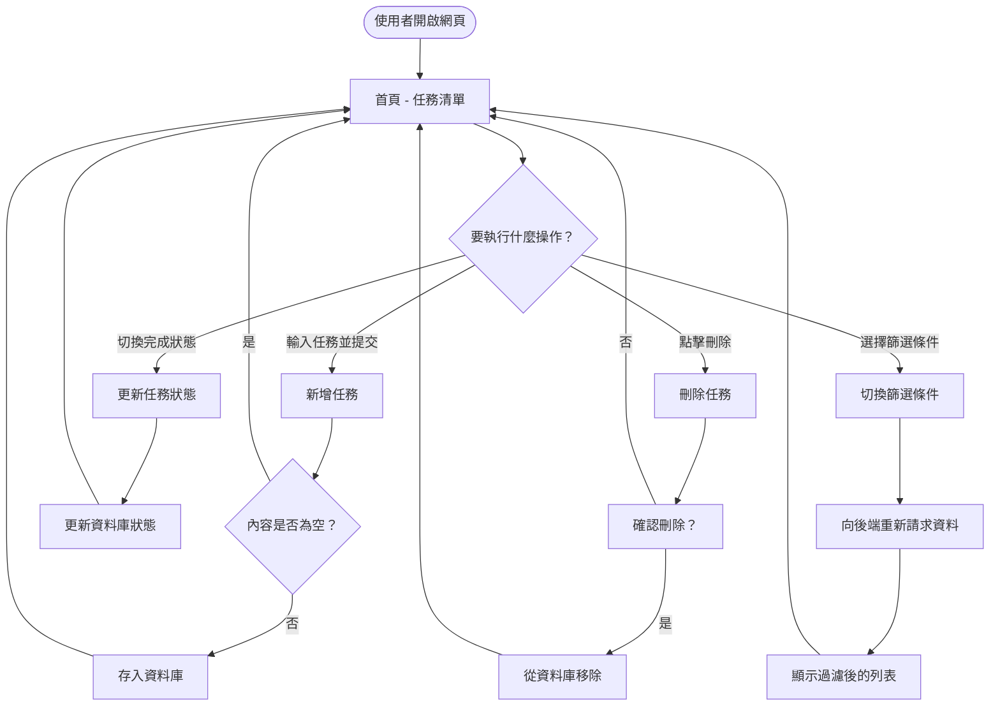
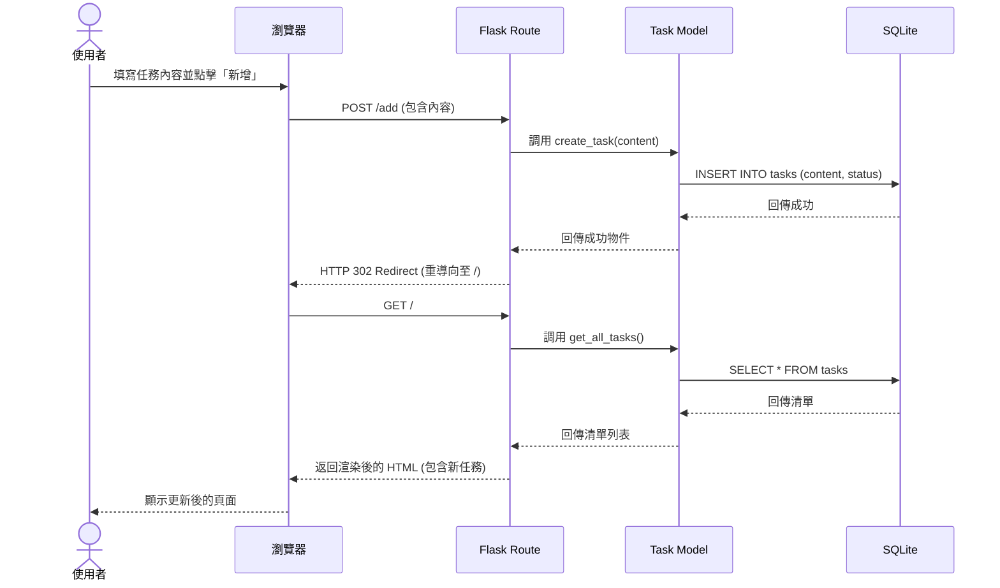

# 流程圖設計文件 (FLOWCHART.md) - 任務管理系統

## 1. 使用者流程圖 (User Flow)

描述使用者在進入網站後，如何與網頁互動完成主要功能任務。

---

## 2. 系統序列圖 (Sequence Diagram)

以「新增任務」為例，展示系統內部元件如何協作。

---

## 3. 功能清單對照表 (Preliminary API Mapping)

本表列出初步規劃的路由與對應操作。

| 目標功能 | URL 路徑 | HTTP 方法 | 說明 |
| :--- | :--- | :--- | :--- |
| **首頁/列表顯示** | `/` | `GET` | 顯示所有任務清單，支援 URL 參數篩選（如 `/?filter=done`）。 |
| **新增任務** | `/add` | `POST` | 接收表單資料並建立新任務。 |
| **更新狀態** | `/toggle/<int:id>` | `POST` | 切換指定任務的完成/未完成狀態。 |
| **刪除任務** | `/delete/<int:id>` | `POST` | 移除指定任務。 |

---

## 4. 流程設計決策說明

1. **後端重導向 (Redirect)**：在新增、更新、刪除操作後，皆採用 PRG (Post/Redirect/Get) 模式，將使用者重導向回首頁。這樣可以避免重新整理頁面時重複提交表單。
2. **後端篩選**：點擊篩選標籤（如：全部、未完成、已完成）時，會帶入不同的 Query String 參數請求首頁，由 Flask 根據參數決定 SQL 查詢語句。
3. **簡易互動**：目前設計為點擊按鈕即執行，後續若需提升體驗，可在刪除前加入簡單的 Javascript `confirm()` 視窗。

---
